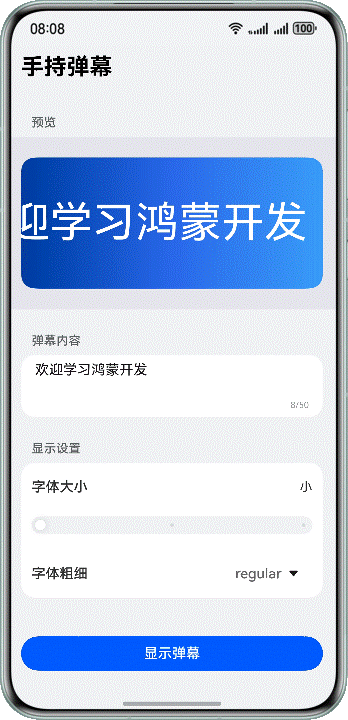

# 快速入门-手持弹幕

## 项目简介

本示例通过ArkTS基本语法、ArkUI基本能力实现手持弹幕场景，提供手把手的教学实践，从零基础开始，带开发者快速掌握应用开发的基础技能。完成工程在基础弹幕功能上新增了弹幕颜色自定义、速度调节、历史记录、统计面板、关键词过滤、预设模板、主题切换、显示区域、自由流转、弹幕显示方式（滑动/滞留）共 10 项扩展功能。

## 效果预览



## 使用说明

1. 在模拟器/直板机/平板上运行本工程，进入首页。
2. 修改弹幕内容，预览区弹幕内容实时更新，文本超长时滚动。
3. 修改字体大小，预览区文本字体大小实时更新，字体大小位置根据具体值显示为"大"、"中"或"小"。
4. 修改字体粗细，预览区文本字体粗细实时更新，选中的选项同步更新。
5. 选择弹幕颜色、滚动速度、显示方式（滑动弹幕/滞留弹幕）、显示区域（上方/居中/下方）、弹幕主题。
6. 点击"显示弹幕"按钮，页面跳转并横屏展示弹幕内容。滑动弹幕从右往左滚动，滞留弹幕静止居中显示。
7. 点击右上角播报按钮，AI播报当前弹幕内容。
8. 点击左上角返回按钮，页面跳转回设置页面。
9. 使用预设模板快速填充弹幕内容。
10. 使用关键词过滤，发送时自动将敏感词替换为*号。
11. 查看弹幕历史记录和发送统计面板。
12. 在两台登录同一华为账号的设备间可自由流转弹幕显示。

## 工程目录
```
├──1_UI                                   // 开发弹幕设置静态页面
├──2_Function                             // 开发弹幕设置页面交互
├──3_SecondPage                           // 开发弹幕展示页面
└──4_AI                                   // AI语音朗读
   ├──4_Start                             // 起始工程
   └──4_Complete                          // 完成工程
      ├──entry/src/main/ets               // 代码区
      │  ├──entryability
      │  │  └──EntryAbility.ets           // 程序入口类（含自由流转回调）
      │  ├──entrybackupability
      │  │  └──EntryBackupAbility.ets
      │  ├──model
      │  │  └──Settings.ets               // 设置类（含DisplayArea/DisplayMode枚举+流转序列化）
      │  ├──pages
      │  │  ├──Index.ets                  // 首页，即弹幕设置页（含流转恢复逻辑）
      │  │  ├──Led.ets                    // 手持弹幕页（支持滑动/滞留两种模式）
      │  │  ├──HistoryPage.ets            // 弹幕历史记录页
      │  │  └──StatsPage.ets              // 弹幕统计面板页
      │  └──utils
      │     ├──Speaker.ets                // 语音朗读类
      │     ├──HistoryManager.ets         // 历史记录管理器
      │     ├──StatsManager.ets           // 统计数据管理器
      │     ├──KeywordFilter.ets          // 关键词过滤器
      │     ├──PresetTemplates.ets        // 预设模板库
      │     └──ThemeManager.ets           // 主题管理器
      └──entry/src/main/resources         // 应用静态资源目录
```

## 具体实现

1. 通过ArkTS基础能力实现基本页面效果。
2. 使用Navigation组件实现页面路由。
3. 使用AI文本转语音能力实现AI朗读播报。
4. 使用preferences实现历史记录、统计数据、关键词的持久化存储。
5. 使用TextOverflow.MARQUEE实现滑动弹幕，静态Text实现滞留弹幕。
6. 通过DisplayMode枚举和条件渲染实现滑动/滞留弹幕切换。
7. 通过UIAbility的continuable声明和onSaveData/onRestoreData回调实现自由流转。

## 相关权限

不涉及。

## 约束与限制

1. 本示例支持标准系统上运行，支持设备：模拟器、直板机、平板、2in1设备。
2. HarmonyOS系统：HarmonyOS 6.0.0 Release及以上。
3. DevEco Studio版本：DevEco Studio 6.0.0 Release及以上。
4. HarmonyOS SDK版本：HarmonyOS 6.0.0 Release SDK及以上。
